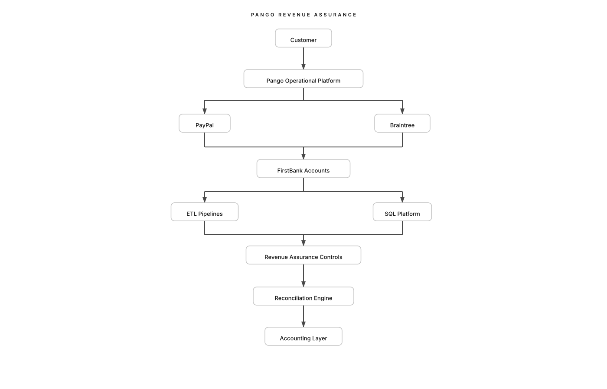

# Pango Revenue Assurance

An end-to-end Revenue Assurance and Financial Reconciliation platform designed to validate, monitor and reconcile the complete revenue lifecycle of the Pango parking ecosystem.

---

# Project Overview

The objective of this project is to build a centralized Revenue Assurance platform capable of validating that every financial event generated within the Pango platform is correctly processed, settled, deposited and ultimately recorded.

The platform combines operational data, payment processor activity, banking information and financial controls into a single analytical environment.

---

# Revenue Lifecycle

```text
Customer
        ↓
Pango Platform
        ↓
Payment Processors
        ↓
FirstBank
        ↓
Accounting
```

The long-term objective is to automatically detect inconsistencies across every stage of this lifecycle.

---

# Current Capabilities

## Financial Architecture

* Financial account mapping
* Internal cash flow documentation
* Revenue flow analysis
* Treasury flow documentation

## Operational Analysis

* Backend architecture documentation
* Revenue stream identification
* Payment processor mapping
* Banking analysis

## ETL Platform

Implemented pipelines:

* PayPal → payment_transactions
* FirstBank → bank_transactions

Both datasets are automatically normalized into a common analytical model.

## SQL Platform

Current analytical database:

* payment_transactions
* bank_transactions

Implemented using MySQL.

## Revenue Assurance Controls

Current automated controls include:

* Daily processor activity
* Daily settlement monitoring
* Processor fee analysis
* Refund monitoring
* Dispute monitoring
* Settlement frequency
* Largest settlements
* Average customer payment analysis

## Reconciliation Engine

Current prototype:

PayPal Processing

↓

FirstBank Settlement

↓

Automated Daily Reconciliation

---

# Repository Structure

```text
docs/
    business-flow/
    data-dictionary/
    findings/
    progress/
    reconciliation-rules/
    revenue-map/
    system-diagrams/
    system-inventory/

sql/
    Revenue Assurance queries
    Reconciliation controls
    Database schema

src/
    classifiers/
    extractors/
    loaders/
    normalization/
    parsers/
    reconciliation/

data/
    raw/
    normalized/
    reports/
```

---

# Current Project Status

| Phase                         | Status        |
| ----------------------------- | ------------- |
| Financial Architecture        | ✅ Completed   |
| Backend Analysis              | ✅ Completed   |
| Banking Analysis              | ✅ Completed   |
| PayPal ETL                    | ✅ Completed   |
| FirstBank ETL                 | ✅ Completed   |
| SQL Platform                  | ✅ Operational |
| Revenue Assurance Controls    | ✅ Implemented |
| Initial Reconciliation Engine | ✅ Prototype   |

---

# Technology Stack

| Component        | Technology |
| ---------------- | ---------- |
| Language         | Python 3   |
| Database         | MySQL      |
| Data Processing  | Pandas     |
| PDF Extraction   | pdfplumber |
| Excel Processing | openpyxl   |
| SQL Analytics    | MySQL SQL  |
| Documentation    | Markdown   |

---

# Roadmap

## Phase 1 — Foundation

* Financial Architecture
* Banking Analysis
* Backend Analysis
* ETL Pipelines
* SQL Platform
* Initial Reconciliation Engine

**Status:** ✅ Completed

---

## Phase 2 — Advanced Reconciliation

* Rolling settlement matching
* Braintree settlement parsing
* Remaining bank transaction parsing
* Backend operational reconciliation
* QuickBooks integration

---

## Phase 3 — Automated Revenue Assurance

* End-to-end reconciliation
* Automated anomaly detection
* Continuous monitoring
* Executive dashboards
* Revenue Assurance reporting

---

# Project Goal

The final objective is to provide a fully automated Revenue Assurance platform capable of detecting revenue leakages, settlement discrepancies and financial anomalies across the complete payment lifecycle while providing continuous reconciliation between operational systems, payment processors, banking platforms and accounting systems.

<p align="center">
  
</p>